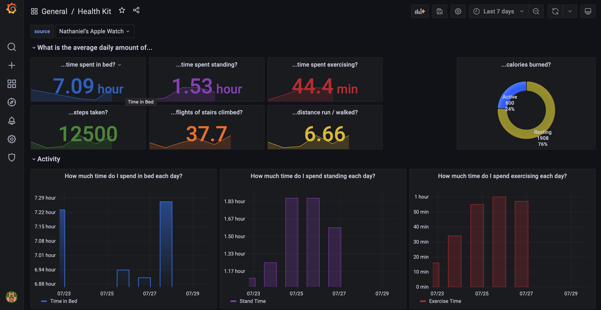
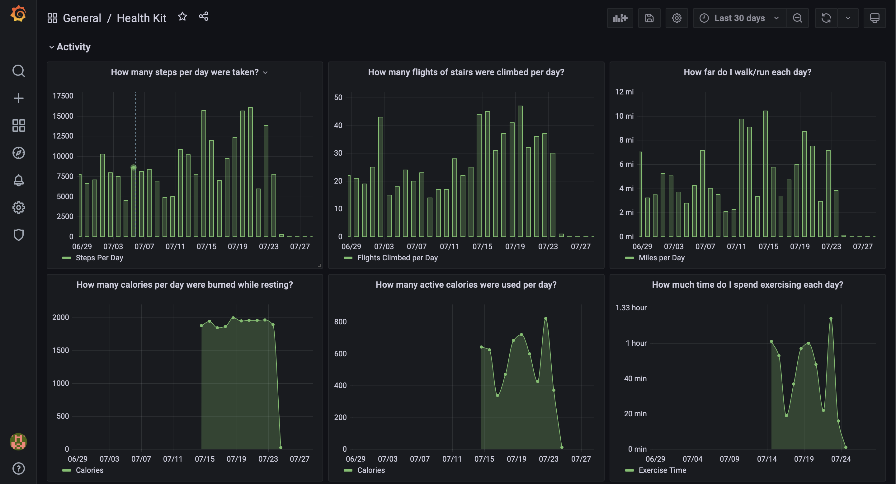
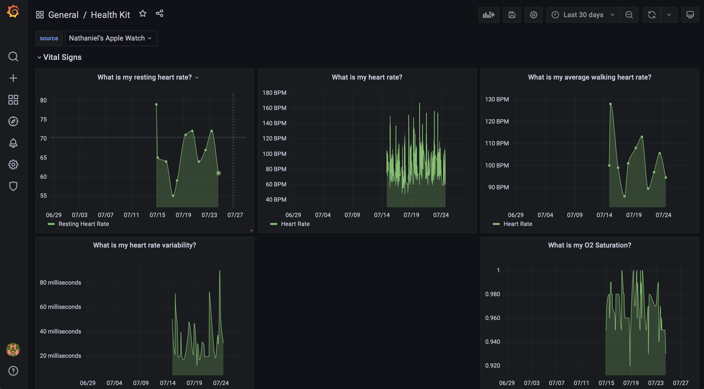
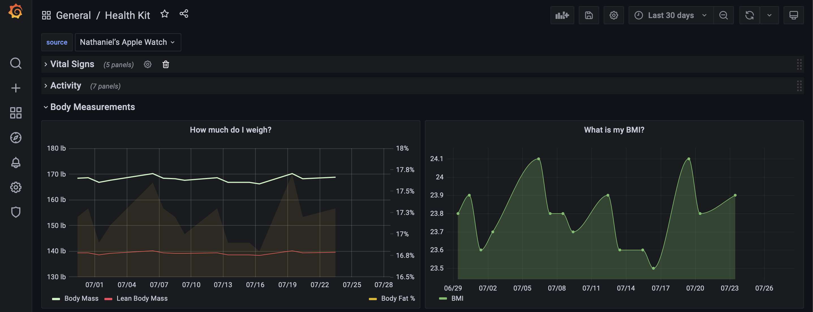

# HealthKitGrafana

Parses the export.xml that Apple Health Kit exports and loads it into a PostgreSQL database.
The docker-compose.yml should work without modification if you put the export.xml file into
the apple_health_export directory.

This is the first working happy path version. There's not much
error checking yet, and it's possible your export.xml has differences which casue your file
to fail. 

## Prerequisites

1. You need to have Docker and Docker compose installed.

## How to use

1. In the Health app on your iPhone click your icon in the top right,
scroll to the bottom, and Export All Health Data.
2. Get the zip file to where you've cloned this repo (I like to use AirDrop), unzip the file,
and place the export.xml file into the apple_health_export directory of this repo.
3. Run docker-compose up and wait for the exporter container to exit.
4. Open a browser at localhost:3000 and login with admin/admin. Change the password when prompted.
5. There should be a dashboard called Health Kit in the General folder, click it.
6. That's it! You should be able to browse your health data graphs.

## Screenshots

## What's Next
Things I plan to change very soon.

* Import the Me xml element into the hk_person table
  * This means linking hk_person's to hk_records
  * Also means writing code to handle export_cda.xml
* Import Workout elements
* Import Lab Results
* More dashboards