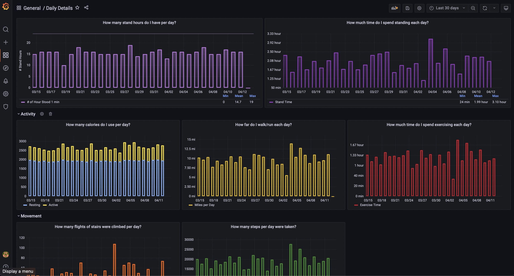
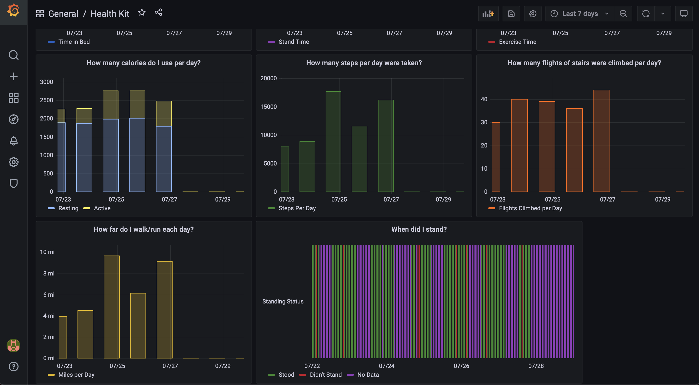
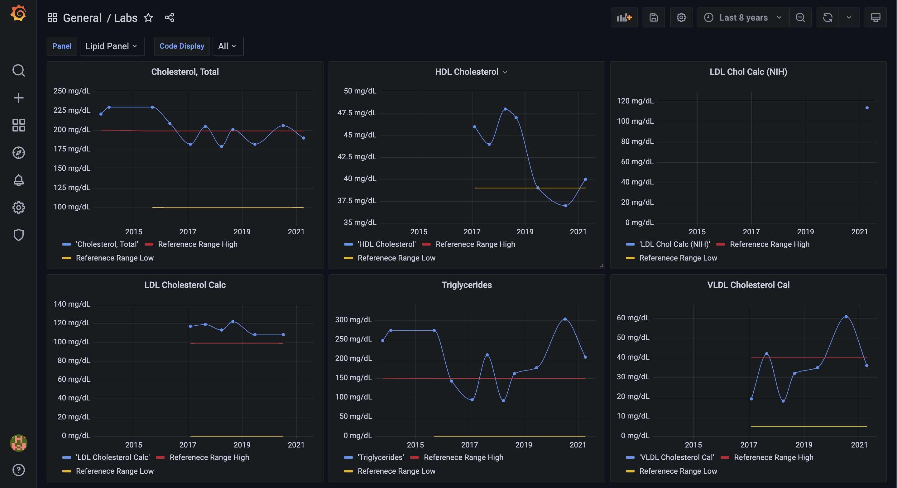

# HealthKitGrafana

Parses the export.xml that Apple Health Kit exports and loads it into a PostgreSQL database.
The docker-compose.yml should work without modification if you put the export.xml file into
the apple_health_export directory.

This is the first working happy path version. There's not much
error checking yet, and it's possible your export.xml has differences which casue your file
to fail. 

## Prerequisites

1. You need to have Docker and Docker compose installed.

## How to use

1. In the Health app on your iPhone click your icon in the top right,
scroll to the bottom, and Export All Health Data.
2. Get the zip file to where you've cloned this repo (I like to use AirDrop), unzip the file,
and place the export.xml file into the apple_health_export directory of this repo.
3. Run docker-compose up and wait for the exporter container to exit.
4. Open a browser at localhost:3000 and login with admin/admin. Change the password when prompted.
5. There should be a dashboard called Health Kit in the General folder, click it.
6. That's it! You should be able to browse your health data graphs.

## Screenshots
You can see daily summaries of metrics collected via iPhone

There's a daily details view if you want to drilldown.

I'm not happy with this but it's good enough till inspiration hits

This definitely needs to be its own dash due to the frequency of the data.

Kinda lame with only weight, not sure where this will end up

And finally the true inspiration for all of this work, to be able to track my labs
over time and see how various metrics interact (e.g. HDL vs LDL).

As you can see my numbers are a big motivator to do better.

And 
## Known Issues
* The queries are hard coded to US/MDT timezone. I think in the code I'll 
want to convert timestamps to UTC before insertion in the DB.
* Currently, I've only test labs against the files pulled from LabCorp. I 
have low expectations of it working for other providers considering I 
hard coded it to look only at files that start with "DiagnosticReport"
* The Labs implementation needs a lot of error checking, currently
what's committed is the first pass that worked with my data.
* It appears I'm getting a lot of duplicate lab files in the HealthKit
export, need to figure out what that's all about.

## What's Next
Things I plan to change very soon.

* Import the Me xml element into the hk_person table
  * This means linking hk_person's to hk_records
  * Also means writing code to handle export_cda.xml
* ~~Import Workout elements~~
* ~~Import Lab Results~~
* Clean up lab import code
* More dashboards
  * Next is a monthly summary
* Consider if using pydantic would save time/code

## Helpful Links

These two were ridiculously helpful for understanding HealthKit:
https://developer.apple.com/documentation/healthkit/hkquantitytypeidentifier
https://developer.apple.com/documentation/healthkit/hkcategorytypeidentifier

This is good for understanding the clinical records (labs) json format
https://github.com/smart-on-fhir/client-py